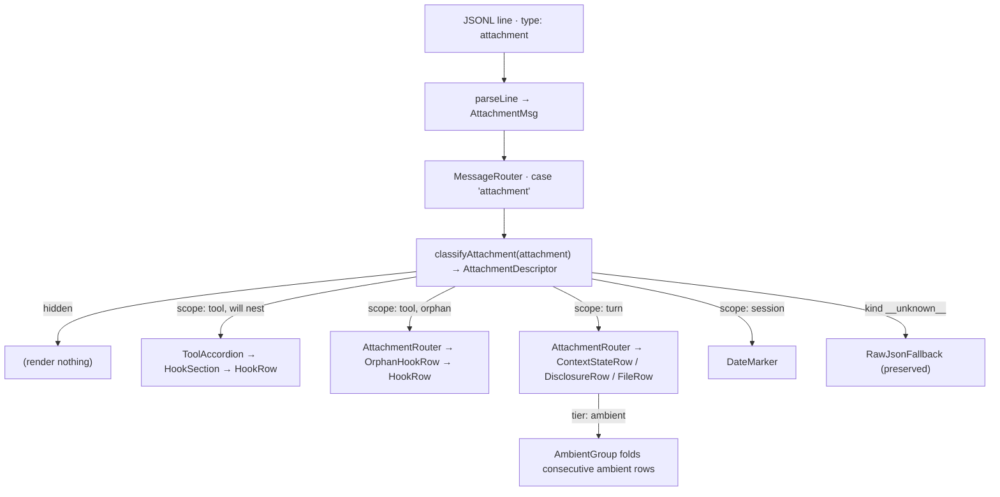

# Attachment Rendering

The Claude Code CLI writes a large family of JSONL lines with `type: "attachment"`, each carrying its own `attachment.type` discriminator (22 known kinds). In the **expanded** transcript view these were once dumped verbatim through the raw-JSON fallback; this subsystem gives every known kind a deliberate outcome — a purpose-built row, or nothing at all — while keeping the fallback for genuinely unknown future kinds.

## The pipeline

Rendering is a three-stage, data-driven flow. The decision lives entirely in one pure function so it can be fixture-tested without a DOM; the React components are thin presenters that *style* the decision, they do not re-make it.

1. **Classify.** [classify-attachment.ts](./www/lib/classify-attachment.ts#L167-L535)`#classifyAttachment` maps each payload to an `AttachmentDescriptor` carrying `scope` (`tool` / `turn` / `session`), `tier` (`content` / `ambient`), a `summary` one-liner, an optional severity `glyph`, the fail-closed `hidden` flag, an optional `linkPath`, and `expandable`. An unrecognized `attachment.type` returns the `__unknown__` sentinel.
2. **Route.** [MessageRouter.tsx](./www/components/expanded/messages/MessageRouter.tsx#L379-L440)`#MessageRouter` (the `case 'attachment'` arm) skips hooks that will nest in a tool, drops `hidden` rows, wraps turn-scoped ambient rows in an [AmbientRow](./www/components/expanded/messages/AmbientGroup.tsx#L41-L55) marker, and otherwise hands off to the [AttachmentRouter](./www/components/expanded/messages/attachment/AttachmentRouter.tsx#L103-L120).
3. **Present.** The per-type presenters render the descriptor; the [AttachmentRouter](./www/components/expanded/messages/attachment/AttachmentRouter.tsx#L103-L120) dispatches to one of them or, for `__unknown__`, to [RawJsonFallback](./www/components/expanded/messages/RawJsonFallback.tsx#L25-L34).

## Tool-scoped — hooks nest in their tool

The six `hook_*` types are events *about* a specific tool call. A pre-pass, [computeWillNestToolUseIds](./www/components/expanded/messages/MessageRouter.tsx#L65-L123), determines up front which tool ids will render an accordion; a hook whose `toolUseID` is in that set is nested (never duplicated), and a hook with no owning tool renders as a standalone orphan. Both paths share one row component, [HookRow](./www/components/accordions/HookRow.tsx#L109-L196), so nested and orphan hooks look and expand identically. Inside a tool they are grouped by `hookEvent` in the [HookSection](./www/components/accordions/HookSection.tsx#L48-L80); the expandable body text is assembled by [hookBodyText](./www/components/accordions/HookRow.tsx#L61-L108).

| Type | Glyph / treatment | Body | Classifier |
|---|---|---|---|
| `hook_success` | `✓` neutral | stdout / content | [case](./www/lib/classify-attachment.ts#L173-L187) |
| `hook_additional_context` | `context` tag | joined `content[]` | [case](./www/lib/classify-attachment.ts#L188-L202) |
| `hook_system_message` | `message` tag | `content` | [case](./www/lib/classify-attachment.ts#L203-L217) |
| `hook_non_blocking_error` | `!` warning glyph | stderr (+ run fields) | [case](./www/lib/classify-attachment.ts#L218-L232) |
| `hook_blocking_error` | `✗` error glyph + left border; escalates the collapsed tool header | `blockingError.blockingError` + `command` | [case](./www/lib/classify-attachment.ts#L233-L247) |
| `hook_cancelled` | `○` neutral leaf | — | [case](./www/lib/classify-attachment.ts#L248-L266) |

A `hook_blocking_error` is the one signal the design draws the eye to: it tints the owning tool's collapsed header (`✗ blocked by {hookName}`), and as an orphan — which is the real-world norm for `Stop`-hook refusals — it stays standalone, colored, and expands to reveal *why* the run was blocked.

## Turn-scoped — ambient state and content disclosures

Turn-scoped attachments are environment/context events with no owning tool. The **ambient tier** reads quieter than a tool row and consecutive ambient rows fold into one bordered zone (or a `context updated · N changes` summary for long runs) via [AmbientGroup](./www/components/expanded/messages/AmbientGroup.tsx#L57-L76). The **content tier** carries openable payloads at tool-row weight.

Ambient rows — [ContextStateRow](./www/components/expanded/messages/attachment/ContextStateRow.tsx#L92-L114):

| Type | Summary | Note | Classifier |
|---|---|---|---|
| `team_context` | `Team {teamName} · {agentName}` | multi-agent identity | [case](./www/lib/classify-attachment.ts#L267-L281) |
| `command_permissions` | `Permissions: {n} tools allowed` | **hidden when empty** | [case](./www/lib/classify-attachment.ts#L282-L296) |
| `deferred_tools_delta` | `Tools available +{a} −{r}` | **hidden when every delta empty** | [case](./www/lib/classify-attachment.ts#L297-L315) |
| `mcp_instructions_delta` | `MCP instructions +{addedNames}` | | [case](./www/lib/classify-attachment.ts#L316-L329) |
| `task_reminder` | `Tasks pending · {itemCount}` | **hidden when `itemCount === 0`** | [case](./www/lib/classify-attachment.ts#L330-L344) |

Content-tier disclosures — [DisclosureRow](./www/components/expanded/messages/attachment/DisclosureRow.tsx#L102-L131) (memory / skills) and [FileRow](./www/components/expanded/messages/attachment/FileRow.tsx#L102-L161) (files / edits / queued commands / IDE leaves):

| Type | Summary | Body | Classifier |
|---|---|---|---|
| `nested_memory` | `Memory · {basename}` | nested memory content (markdown) | [case](./www/lib/classify-attachment.ts#L401-L416) |
| `skill_listing` | `Skills available · {skillCount}` | skill catalog | [case](./www/lib/classify-attachment.ts#L417-L430) |
| `invoked_skills` | `Skills loaded · {n}` | one section per skill → its content | [case](./www/lib/classify-attachment.ts#L431-L444) |
| `dynamic_skill` | `Dynamic skills · {displayPath}` | skill names | [case](./www/lib/classify-attachment.ts#L445-L457) |
| `file` | `{basename}` (linkified) | file content (markdown) | [case](./www/lib/classify-attachment.ts#L458-L473) |
| `edited_text_file` | `{basename} edited` (modified hue) | line-numbered snippet | [case](./www/lib/classify-attachment.ts#L474-L487) |
| `queued_command` | `⏎ queued: "{prompt}"` | full prompt + commandMode | [case](./www/lib/classify-attachment.ts#L488-L506) |
| `compact_file_reference` | `{displayPath}` (linkified leaf) | — | [case](./www/lib/classify-attachment.ts#L345-L361) |
| `opened_file_in_ide` | `opened {basename}` | — · **always hidden** (IDE noise) | [case](./www/lib/classify-attachment.ts#L362-L375) |
| `selected_lines_in_ide` | `{basename} :{start}–{end}` (leaf) | selected `content`, expands on click | [case](./www/lib/classify-attachment.ts#L376-L400) |

File-reference **leaves** (`compact_file_reference`, `opened_file_in_ide`, `selected_lines_in_ide`) carry a static `·` bullet rather than a chevron, so they don't read as a tool row whose chevron failed to render.

## Session-scoped — timeline markers

- `date_change` → [DateMarker](./www/components/expanded/messages/attachment/DateMarker.tsx#L28-L37): a thin, right-aligned `{newDate}`, demoted below the compaction/session boundaries so the markers don't read as equal-weight noise. Because it is session-scoped it is **not** wrapped in `AmbientRow`, so it never folds into (or is collapsed away by) an `AmbientGroup`. [case](./www/lib/classify-attachment.ts#L507-L520)
- `away_summary` is a `system` subtype (not an attachment): [SystemRouter](./www/components/expanded/messages/system/SystemRouter.tsx) dispatches it to [AwaySummaryBoundary](./www/components/expanded/messages/system/AwaySummaryBoundary.tsx#L30-L55), a session-boundary separator that expands to the full content.

## What is actually hidden

Four types carry a fail-closed hide predicate — a populated payload always renders; only a provably-empty one disappears. On a real corpus these account for the bulk of the former raw-JSON volume: the empty `task_reminder` "no pending tasks" nudge, empty `command_permissions` grants, no-op `deferred_tools_delta` lines, and every `opened_file_in_ide` (the only unconditional hide).

## The preserved fallback

Genuinely unknown / future `attachment.type` values classify as `__unknown__` and still render through [RawJsonFallback](./www/components/expanded/messages/RawJsonFallback.tsx#L25-L34) — the safety net stays, so a new producer type is visible (as dimmed JSON) rather than silently dropped. The same holds for unknown `system` subtypes.
