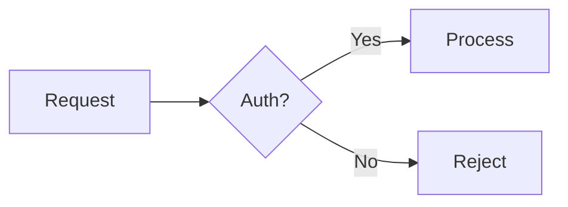

<markdown-guidelines>

**Every codebase concept named in prose — file, module, component, hook, utility, type, or configuration — must be a fragment link when a workspace file defines it.** Mentioning a concept without linking it forces the reader to search manually.

This applies across all markdown surfaces: card descriptions, plans, comments, document sidecars, and commit message bodies.

```markdown
<!-- Bad: named concepts without links -->
The TokenRefresher calls validateSession, which reads auth-config.yaml.

<!-- Good: every named concept is linked -->
The [TokenRefresher](./src/auth/refresher.ts) calls [validateSession()](./src/auth/session.ts#L15),
which reads [auth-config.yaml](./config/auth-config.yaml).
```

## 1. Fragment Links

When markdown references a workspace file, function, or code location, use a markdown fragment link — not a backtick code span. The card-detail webview renders fragment links as clickable buttons that open the file in the editor.

Non-workspace paths (e.g., `~/.cards/cards-api.json`) and external URLs remain as backtick code spans or plain text.

### 1.1 Soft Links

Anchor natural prose to a relevant file. The reader follows the narrative; the link provides navigation.

```markdown
The [token refresh logic](./src/auth/refresh.ts) now handles network timeouts.
```

### 1.2 Precise Links

Point to a specific line or range when the reader needs the exact location.

```markdown
[src/auth/provider.ts L42](./src/auth/provider.ts#L42)
[src/auth/provider.ts L42–L58](./src/auth/provider.ts#L42-L58)
```

### 1.3 Function References

Anchor a function or method name to its definition site.

```markdown
[startCardsApi()](./packages/extension/src/lifecycle/cardsApiLifecycle.ts#L42)
```

## 2. Mermaid Diagrams

The webview renders fenced `mermaid` code blocks as inline SVG diagrams. If rendering fails, the raw source is displayed as a fallback.

Use mermaid when the structure is the point — multi-component interactions, state transitions, data flows, or decision trees. Use prose when the explanation is the point.

````markdown

````

## 3. Collapsible Sections

Use `<details>` and `<summary>` for content that supports the narrative but would interrupt it inline — long error output, verbose investigation logs, or optional context.

A blank line is required after `<summary>` for markdown to render inside the block.

```markdown
<details>
<summary>Full error output</summary>

Error content here. **Markdown works** inside the block.

</details>
```

## 4. Code Blocks

Always include a language tag on fenced code blocks for syntax highlighting. The webview highlights: `typescript`, `javascript`, `jsx`, `tsx`, `python`, `css`, `html`, `shell`, `json`, `yaml`, `go`, `rust`, `markdown`, `diff`, `sql`, `ruby`, `java`, `c`, `cpp`, `csharp`.

````markdown
```typescript
const x: number = 42;
```
````

</markdown-guidelines>
