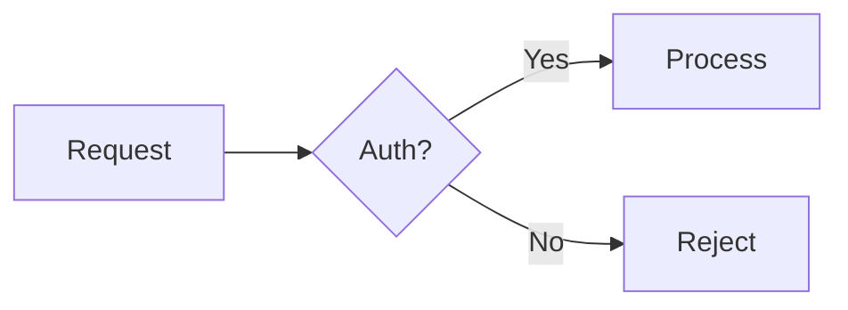

## Commit Message Styles

Two repositories receive commits during card work. Each has a distinct commit style.

<card-repo-commit-style>
### Card Repository Commits

Card repository commit messages summarize the content of the commit itself. An agent scanning `git log --oneline` should understand what information each commit contributes without opening the files.

**The commit message is a single sentence summarizing the commit's substance** — not a status label or inventory of files changed. If the commit adds a comment, the message summarizes the comment. If it adds a plan, the message summarizes the approach.

**Format:** One sentence. The comment content carries detail; the commit message carries a summary of that detail.

**Examples:**

| Category | Example |
|----------|---------|
| Progress | `Auth middleware validates tokens and attaches user context to requests` |
| Completion | `All four migration tasks pass type checking and integration tests` |
| Blocked | `Package X exports an incompatible type that prevents the adapter from compiling` |
| Clarification | `Title narrowed to auth middleware; added exploration notes on token flow` |
| Plan | `Three-task migration strategy starting with schema, then adapters, then callers` |
| Plan feedback | `Revised to add explicit error handling for expired tokens per feedback` |
| Accepted concerns | `Coupling tradeoff between auth and session modules accepted as pragmatic` |
| Awaiting review | `Middleware, tests, and integration wiring are complete and ready for review` |
| Question/answer | `Tokens are validated by comparing HMAC signatures against the rotated secret` |
| Reopen | `Additional error handling needed for network timeouts during token refresh` |
| Error recovery | `Merge failed due to conflicting changes in session.ts — needs manual resolution` |
| No-action | `User provided context on deployment constraints, no code changes needed` |
</card-repo-commit-style>

<workspace-commit-style>
### Workspace Repository Commits

Workspace commits are the narrative layer of code history. Future developers will read these to understand not just *what* changed, but *why* and *how*.

#### Structure (2-5 paragraphs, scaled to change scope)

**Paragraph 1 — The Hook**: One full sentence summarizing the substance of the commit (plain text, no markdown). Follow with why this change matters in broader system context.

**Paragraph 2 — The Problem**: What challenge or deficiency prompted this work? Paint the "before" picture.

**Paragraph 3 — The Journey** (for substantial changes): Alternatives considered, what made this approach win, pivots or dead ends. This is the heart of the narrative — what makes the message memorable and educational.

**Paragraph 4 — The Solution**: What was built, focusing on *design* over file lists. Patterns established, tradeoffs accepted.

**Paragraph 5 — The Future** (optional, for large changes): What this enables, remaining work, guidance for maintainers.

#### Scaling

| Commit Type | Length |
|-------------|--------|
| Small fix / refactor | Subject sentence + optional card reference line |
| Feature / bug fix | 2-3 paragraphs: problem, approach, solution |
| Major milestone | 2-5 paragraphs: the full story per the structure above |

#### Voice

Active voice, present tense. Write paragraphs as continuous prose — do not break lines for length. Use markdown for structure and clarity in the body. Match energy to change scope — a small fix deserves small prose.

#### File References

Follow the `<markdown-guidelines>` for all file references in commit bodies.

#### Truth Over Profundity

Include genuine insight when it emerges — a surprise, an irony, a lesson that only became clear after the work. When it does not, move on. The test: would this help someone debugging at 2am?

#### Synthesizing from Subagent Reports

Collect Decision Narratives from agent reports, extract what changed and what was learned, discard performative struggle. Weave a unified story, not a list.
</workspace-commit-style>

<markdown-guidelines>

## 1. Fragment Links

When markdown references a workspace file, function, or code location, use a markdown fragment link — not a backtick code span. The card-detail webview renders fragment links as clickable buttons that open the file in the editor.

Non-workspace paths (e.g., `~/.cards/cards-api.json`) and external URLs remain as backtick code spans or plain text.

### 1.1 Soft Links

Anchor natural prose to a relevant file. The reader follows the narrative; the link provides navigation.

```markdown
The [token refresh logic](./src/auth/refresh.ts) now handles network timeouts.
```

### 1.2 Precise Links

Point to a specific line or range when the reader needs the exact location.

```markdown
[src/auth/provider.ts L42](./src/auth/provider.ts#L42)
[src/auth/provider.ts L42–L58](./src/auth/provider.ts#L42-L58)
```

### 1.3 Function References

Anchor a function or method name to its definition site.

```markdown
[startCardsApi()](./packages/extension/src/lifecycle/cardsApiLifecycle.ts#L42)
```

### 1.4 Coverage

Every codebase concept named in prose — file, module, component, hook, utility, type, or configuration — should be a fragment link when a workspace file defines it. Mentioning a concept without linking it forces the reader to search manually.

This applies across all markdown surfaces: card descriptions, document sidecar summaries, plans, comments, and commit message bodies.

```markdown
<!-- Bad: named concepts without links -->
The TokenRefresher calls validateSession, which reads auth-config.yaml.

<!-- Good: every named concept is linked -->
The [TokenRefresher](./src/auth/refresher.ts) calls [validateSession()](./src/auth/session.ts#L15),
which reads [auth-config.yaml](./config/auth-config.yaml).
```

## 2. Mermaid Diagrams

The webview renders fenced `mermaid` code blocks as inline SVG diagrams. If rendering fails, the raw source is displayed as a fallback.

Use mermaid when the structure is the point — multi-component interactions, state transitions, data flows, or decision trees. Use prose when the explanation is the point.

````markdown

````

## 3. Collapsible Sections

Use `<details>` and `<summary>` for content that supports the narrative but would interrupt it inline — long error output, verbose investigation logs, or optional context.

A blank line is required after `<summary>` for markdown to render inside the block.

```markdown
<details>
<summary>Full error output</summary>

Error content here. **Markdown works** inside the block.

</details>
```

## 4. Code Blocks

Always include a language tag on fenced code blocks for syntax highlighting. The webview highlights: `typescript`, `javascript`, `jsx`, `tsx`, `python`, `css`, `html`, `shell`, `json`, `yaml`, `go`, `rust`, `markdown`, `diff`, `sql`, `ruby`, `java`, `c`, `cpp`, `csharp`.

````markdown
```typescript
const x: number = 42;
```
````

</markdown-guidelines>
